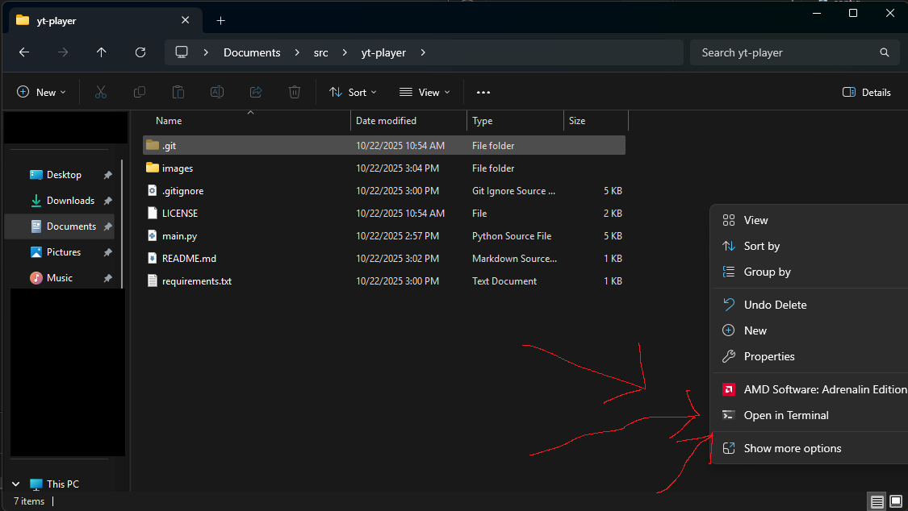
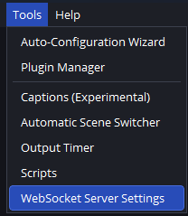
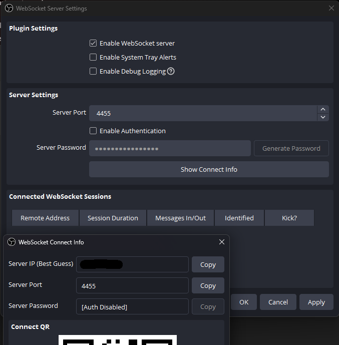
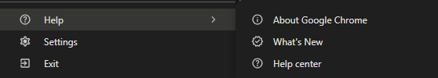
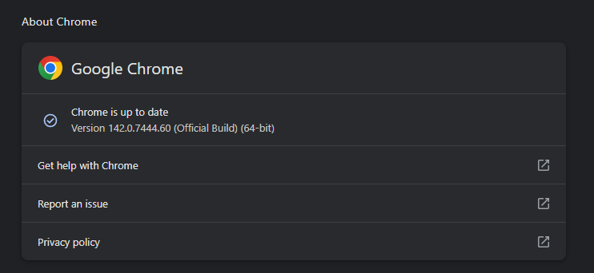

# yt-player
Plays a random YouTube playlist from a list of playlists. Restarts the stream within OBS after a period of time to avoid stream dying.

## Quick Start
- [Download source as a ZIP](./archive/refs/heads/main.zip)
- Unzip the source
- Edit config.py to change the any of the configuration variables.
- Install python
- Install the packages in requirements.txt
- Setup OBS WebSocket to allow connections.
- Run the code with `python .\main.py`
- Follow the prompt, hit enter to start it running.

## Installing Python
Open a PowerShell windows and type the python command.  

If you have python installed, it should drop you into a python interpreter. Type "quit()" to exit.  
Otherwise it should open the Windows store, press install to install the latest version of python3.  

Install python dependencies:  
Right click the folder where you unzipped this project without selecting a file.  
Click "Open in terminal" from the presented options.  
  

In the terminal, type the following command:  
`python -m pip install --upgrade -r requirements.txt`

## Setting up the OBS WebSocket
In OBS, navigate to Tools -> WebSocket Server Settings.  
  

Ensure the "Enable WebSocket server" checkbox is checked, and Enable Authentication if you wish to run securely.  
You can then click to Copy the Server Password from the "Show Connect Info" screen and paste it between the quotation marks in the config.py.  

## Run the code
`python .\main.py`

or if your profile is already setup you can skip the setup prompt by modifying  with the following setting

`PAUSE_FOR_BROWSER_LOGIN           = False`

## Troubleshooting
If it tells you you are using Chrome 1.\<some number\> and you need to be using Chrome 1.\<some higher number\>, update Chrome by going to the About Chrome tab under Help and following the prompt. It should then work.  

